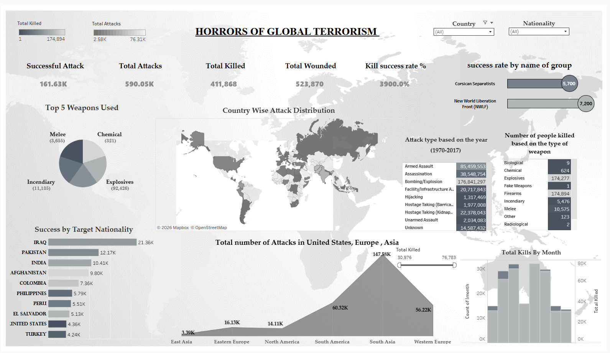
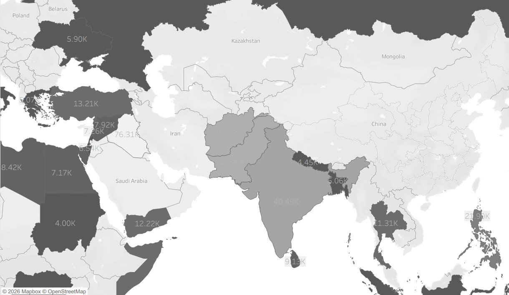
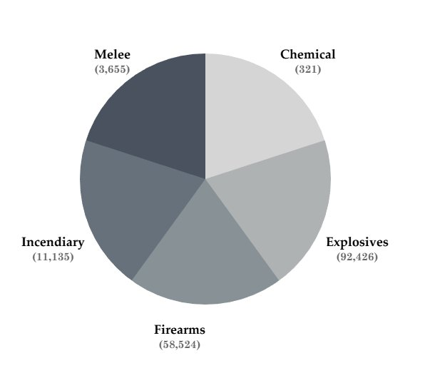
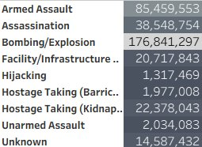

# Global Terrorism Analysis (1970–2017)

A Tableau dashboard analyzing 181,691 terrorism records across 47 years, built to uncover regional hotspots, weapon lethality patterns, and the human cost behind the numbers.

**[View Interactive Dashboard on Tableau Public](https://public.tableau.com/app/profile/tejashwinisaravanan/viz/TheGlobalTerrorsim/TheGlobalTerrorism)**

<p align="center">
  <a href="https://public.tableau.com/app/profile/tejashwinisaravanan/viz/TheGlobalTerrorsim/TheGlobalTerrorism">
    
  </a>
</p>

---
 
## Overview

This project analyzes the Global Terrorism Database (GTD), one of the most comprehensive open-source databases on terrorist activity, to surface patterns across nearly five decades of recorded incidents (1970–2017).

The goal was not just to visualize data, but to answer a specific question: where are attacks concentrated, what makes them lethal, and what does that mean for how resources should be allocated? By reducing 135 variables down to the most analytically meaningful ones and building calculated metrics from scratch, the dashboard tells a story that raw data alone cannot.

---

## The Data

| | |
|---|---|
| Source | [Kaggle – Global Terrorism Database (GTD)](https://www.kaggle.com/datasets/START-UMD/gtd) |
| Cleaned Dataset | [Google Drive](https://docs.google.com/spreadsheets/d/1Na_GEc0VDvpfdwCib3QEfCGgah1m6cZo/edit?usp=sharing&ouid=101474871000924766896&rtpof=true&sd=true) |
| Records | 181,691 incidents |
| Time Span | 1970–2017 |
| Original Variables | 135 columns |

The cleaned dataset is hosted on Google Drive because it exceeds GitHub's 100MB file size limit.

---

## Data Preparation

All preparation was done in Microsoft Excel before loading into Tableau.

**Dimensionality reduction.** The original dataset has 135 variables. Most of them are not useful for visual analysis - they exist for academic coding purposes. I narrowed the working dataset to columns that actually drive insight: Attack Type, Weapon Type, Region, Country, and casualty counts. This also meaningfully improved dashboard performance.

**Cleaning.** Missing values were addressed and regional naming conventions were standardized. This was especially important for geospatial accuracy - inconsistent region labels would have broken the map visualizations.

**Metric engineering.** I created two calculated fields that don't exist in the raw data: Successful Attacks and Kill Success Rate. The distinction between how often an attack occurs and how deadly it is when it does became one of the most important findings in the project.

**Visualization decisions.** Choropleth maps for regional density - geographic patterns are immediately readable at a glance. Bar charts for weapon type comparisons - direct side-by-side comparison without distortion. Time-series line charts for trend analysis across decades.

---

## Key Findings

**South Asia is the most affected region by a large margin.** With 147,580 total attacks, it accounts for more than double the incidents of Western Europe (56,220) and more than ten times those of North America (14,110).

<p align="center">
  
</p>

*Attack density by country - darker shading indicates higher incident counts. Iraq (76.31K), India (40.49K), and Afghanistan are the most heavily affected.*

---

**Frequency and lethality do not tell the same story.** Explosives are the most commonly used weapon with 92,426 incidents. But firearms produce nearly equal total fatalities - roughly 174,000 each. That means firearms have a substantially higher death-per-incident rate. A policy view focused only on the most common weapon would miss the one that kills more reliably.

<p align="center">
  
</p>

*Explosives dominate by frequency (92,426 incidents), but the lethality-per-incident rate for firearms tells a different story.*

---

**Bombing/Explosion accounts for the largest share of total casualties.** Across all attack types, bombing and explosion incidents produced 176,841,297 recorded casualties - far exceeding armed assault (85,459,553) or assassination (38,548,754).

<p align="center">
  
</p>

*Attack types ranked by total casualties. Bombing/Explosion leads by a wide margin, reinforcing the outsized destructive impact of explosive-based attacks.*

---

**Iraq stands out at the country level.** With 21,360 successful attacks, it is the most-affected single country in the dataset.

**The aggregate human cost across the study period:**

| Metric | Count |
|---|---|
| Lives lost | 411,868 |
| Individuals wounded | 523,870 |
| Total incidents | 181,691 |

---

## Repository Structure

```
Global-Terrorism-Analysis-Tableau/
│
├── The Global Terrorism.twbx             # Tableau Packaged Workbook
├── Global Terrorism Analysis Report.pdf  # Full project report
├── Global Terrorism Project Poster.pdf   # Visual summary poster
├── dashboard_preview.png                 # Full dashboard screenshot
├── regional_map.png                      # Regional attack density map
├── weapon_types.png                      # Weapon type breakdown
├── attack_types.png                      # Attack type by casualties
└── README.md
```

---

## Limitations and What I Would Do Differently

The data ends at 2017. That is a real gap - a lot has changed in the global security landscape since then, and any policy application of this analysis would need to account for that.

Attack counts are also not adjusted for population size. South Asia having the most attacks is partly a function of having some of the world's most populous countries. A per-capita view would add important nuance to the regional comparison.

If I were extending this project, I would bring in post-2017 data, add population-adjusted rates for fairer regional comparisons, and layer in a political instability index to give context to why certain regions cluster the way they do. A time-lapse view showing how the geographic distribution of attacks shifted across decades would also strengthen the narrative - the static map captures magnitude but not movement.

---

## Tools

Tableau, Microsoft Excel

---

## About Me

**Tejashwini Saravanan** - Master's student in Data Analytics with a focus on making complex data legible and actionable.

[LinkedIn](https://www.linkedin.com/in/tejashwinisaravanan/) · [Tableau Public](https://public.tableau.com/app/profile/tejashwinisaravanan) · [GitHub](https://github.com/TejashwiniSaravanan)

---

